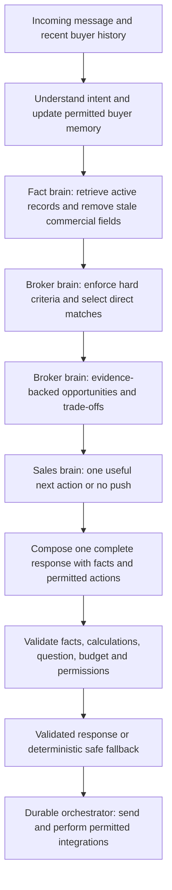

# Commercial real-estate advisor

This change starts from main commit `d0c520f` on branch
`feat/commercial-real-estate-advisor`. It changes conversation routing, buyer
memory, recommendation logic and response validation. The checked-in runtime
policy remains the governing policy; adding prompt text alone cannot correct a
decision made earlier in code. No Airtable schema or records, production
inventory, Railway deployment or main branch are changed by this work.

## Architecture and authority

| Layer | Owns | Cannot do |
| --- | --- | --- |
| Fact brain | Airtable catalogue boundary, fact packs, field freshness, price and initial-payment inputs, application arithmetic and final factual validation | Infer missing prices, payment terms, stock or projected returns |
| Broker brain | Buyer constraints, objective-specific ranking, primary option, challenger and evidenced upgrade assessment | Relax a hard budget, fixed area/type, cash ceiling or contact restriction |
| Sales brain | Objection response, whether to ask once about flexibility, smallest useful next step, no-push state | Manufacture urgency, force capture or report a transaction completed |
| Model composition | Natural explanation and trade-off wording over selected candidates, supplied facts and an authorized strategy | Select inventory independently, grant budget/contact consent, add unsupported claims or execute actions |
| Integration orchestrator | Serialized webhook handling, durable decisions, integration retries, permission rechecks and event/alert deduplication | Treat a handoff request as a completed reservation or guarantee provider-level exactly-once delivery |

The deterministic response works without Anthropic. When a model is configured,
it composes the same authorized decision using the current message, relevant
history, compact buyer state, priorities, objections, selected candidates,
opportunities, fact packs and allowed/forbidden actions. A rejected or unavailable
model response falls back to validated deterministic wording; it cannot weaken
the factual boundary.

## Behavior

Exploring remains a conversation state, rather than a budget form. A volunteered
budget is remembered. An investment question stores investment intent and asks
about income, growth or a mix only while that objective is unknown. Area can
remain open. An exact fit receives useful advice before another qualification
question, and a known or declined field is not requested again without a stated
new reason.

Commercial advice uses one primary option and at most one relevant challenger.
`ADVISOR_MAX_RECOMMENDATIONS` (or the existing `maxProjectsToPitch` preference)
sets a limit of one or two. A challenger must solve a need or objection. Showing a different area
does not overwrite the buyer's preferred area. A fixed area or property type
remains fixed. More expensive inventory receives no automatic ranking advantage.
An upgrade must explain the supported benefit of its exact extra starting price
and the material trade-off; an assessment may instead conclude that paying extra
is not justified for this buyer.

A budget is a hard ceiling until the buyer explicitly permits a stretch. A
materially beneficial candidate can justify asking once whether the ceiling is
firm. A firm answer persists. Consent permits only the recorded amount/percentage
and every over-original-budget recommendation identifies that fact. The default
permitted stretch is 5%, configurable through
`ADVISOR_DEFAULT_BUDGET_STRETCH_PCT` from 0–10%; the effective ceiling is bounded
to 10% of the original budget even when the buyer records a larger willingness.
An explicit AED stretch overrides the default percentage. If both positive AED
and percentage limits are recorded, the smaller one governs; an explicit zero
stretch does not widen back to the default.
Declining an
upgrade suppresses it until the buyer changes that preference.

Objections change the next selection. An initial-payment objection searches for
a lower supported initial commitment, rather than repeating the rejected
project. Rejected projects and their reasons persist. Trust concerns, needing
time and having an agent reduce pressure. "I'm good" ends questioning and
capture. No-call and channel permissions survive advice, plan/availability
questions and transaction-interest follow-up.

The response generator creates one complete message. Structured question metadata
and response validation replace exact-string question appending. Customer copy
does not expose internal catalogue/evidence terminology. A plan, availability or
EOI follow-up continues from the selected option and buyer memory instead of
restarting budget/area/bedroom qualification. EOI and viewing interest use the
existing permission-aware handoff flow; they do not mean an EOI was submitted or a
viewing booked.

## Buyer memory

Advisory preferences live alongside the existing buyer card in `buyers.json` on
the configured runtime volume, not in new Airtable columns. Recent turns and
pending questions/actions use the existing durable conversation memory. Existing
cards receive defaults when updated; no external migration is required.

| New fields and defaults | Purpose |
| --- | --- |
| `explorationState: false`, `investmentObjective: null`, `holdingPeriod: null` | Keep browsing separate from investment/end-use intent. Objective is `rental_income`, `growth` or `balanced`; holding period is stated numeric years |
| `budgetHardCap: true`, `budgetFirm: false`, `budgetFlexible: false`, `budgetFlexibilityPct: 0`, `budgetStretchAed: 0`, `budgetFlexibilityAsked: false` | Default ceiling, explicit firm/flexible choice, authorized stretch and whether flexibility was asked. Original `budgetAed` stays unchanged when a stretch is granted |
| `areaFlexibility: "preferred"`, `propertyTypeFlexibility: false` | Preserve original area while distinguishing `open`, `preferred` and `fixed`; permit type changes only with flexibility |
| `priorities: []`, `concerns: []` | Explain ranking through buyer needs rather than premium labels |
| `objections: []`, `rejectedProjects: []`, `rejectionReasons: {}` | Remember objection category, option, resolution and rejection reasons |
| `shownProjects: []`, `activeRecommendationProjectId: null`, `activeRecommendationUnitId: null` | Follow up on presented inventory; suppress immediate repetition without replacing search preferences |
| `upgradeDeclined: false`, `lastUpgradeProjectId: null` | Stop repeating a declined or just-presented upgrade |

The exact field contract is defined in `src/schema/fields.js` and
`src/conversation/advisory-memory.js`. Budget permission is parsed deterministically;
model-extracted preferences cannot grant it. Changing `budgetAed` resets
flexibility and the asked flag to the default ceiling unless that same update
explicitly grants flexibility. A firm answer sets `budgetFirm: true` and clears
the permitted stretch. Unrelated messages preserve those choices.

An objection is `{ category, projectId, unitId, resolved, at }`. Rejection reasons
are keyed by project id and contain `{ categories, unitId, factFingerprint,
resolved, at }`. Inventory references are set by deterministic exposure/rejection
logic, not accepted as model-created inventory. The 15 supported categories are
`too_expensive`, `initial_payment_too_high`, `wrong_area`, `wrong_property_type`,
`too_small`, `too_large`, `handover_too_late`, `handover_too_soon`,
`payment_plan_bad`, `developer_concern`, `trust_concern`, `needs_time`,
`already_has_agent`, `no_calls` and `not_interested`.

Search resets clear advisory/search criteria and rejections while retaining
identity, phone/contact preference, no-call, language and original creation time
through `BuyerService.resetCriteria`. A reset is not blanket call consent.

## Opportunity evidence

`buildAdvisorOpportunities(catalog, buyer, options)` in
`src/conversation/advisor-opportunities.js` produces structured opportunities,
not buyer-facing prose. Each supported opportunity identifies its project/unit,
category, reason codes, buyer benefit, trade-offs, budget status, supported facts,
confidence and application-calculated price/initial-cash differences. The result
contains `budgetPolicy`, `assessments`, `directMatches`, selected `matches`,
`primary`, `challenger`, `opportunities`, evidence `packs` and
`upgradeAssessment`. `advisorBudgetPolicy` owns the effective ceiling. Differences
must refer to the compared records and their shared price scope. An absent input
does not become a zero or an inferred benefit.

Supported categories are `best_fit`, `smart_upgrade`, `strategic_alternative`,
`lower_cost_alternative`, `cash_flow_alternative`, `growth_alternative`,
`easier_payment_alternative`, `better_timing_alternative` and `no_push`. A category
names the supported comparison route, not a guaranteed commercial outcome.

Material upgrade evidence can include another bedroom, a larger documented size,
a materially lower initial commitment, a supported payment-route improvement or
more suitable documented handover timing. "Premium", a developer name and a
higher price do not pass the why-spend-more test. A different area, developer,
status or property type alone is not a cross-sell benefit. Materiality rules are
explicit: lower starting price saves at least the larger of AED 25,000 or 2%;
lower initial commitment saves at least the larger of AED 10,000 or 10%; a size
benefit requires the new documented minimum to exceed the previous maximum by at
least 10%. Extra bedrooms need a relevant end-use space priority or a too-small
objection. Non-overlapping documented handover periods can solve timing needs;
a summary alone cannot prove a superior installment schedule.

Opportunity `reasonCodes` include supported dimensions such as
`lower_starting_price`, `lower_initial_commitment`, `additional_bedroom`,
`larger_supported_size_range`, `documented_developer_plan`, `earlier_handover`,
`later_handover`, `ready_income_route` and `off_plan_with_documented_plan`.
Trade-off codes identify higher starting price/initial commitment, changed area,
type, bedroom count, developer, plan/timing and unknown stock/initial commitment.
The no-benefit upgrade assessment returns
`no_material_buyer_benefit_for_extra_price` rather than a sales pitch.

Every `supportedFacts` entry binds `{ projectId, unitId, field, value, source,
lastVerified, scope }`. Price scope is `unit_type_starting_price`; initial cash is
either `unit_type_initial_payment` or `project_initial_payment`. A difference is
not an all-in payable amount. `confidence: "high"` means current availability and
a documented numeric initial amount are present; `medium` identifies their gaps.
Confidence never means predicted investment returns are reliable. `matches`
contains only the display shortlist; evidence packs may also contain the
referenced prior property and a deliberate no-push comparison target. A candidate
needing budget permission is excluded from display/fact packs until consent.
Reference arithmetic stays bound to the latest unresolved property objection
across later turns, rather than drifting to the newly selected option.

Investment ranking uses supported entry price, initial commitment, payment-route
and timing characteristics appropriate to the stated objective. End-use ranking
weights supported size, type and timing requirements differently. These are fit
comparisons; the current schema cannot establish which project will appreciate
most or earn the best net return. Growth-route preference uses off-plan status
and a documented developer plan; income-route preference uses Ready status with
documented Ready handover. Neither route is a yield or appreciation forecast.

The composer returns `{ message, askedQuestion, questionField, claims,
proposedActions }`. Each material property claim cites an exact message span and
the current project/unit/field/value. Question metadata must agree with actual
copy and the allowed next question; a paraphrase is permitted without a second
question being appended. Claim citations are independently checked against
current fact packs, including derived monetary differences from supported
opportunities. The model's proposed actions are copy metadata, never execution
permission.

## Airtable limitations and proposed data work

This review inspects the checked-in schema and Airtable mapping; it does not
certify the live base's contents. No schema/data mutation is required for the
implemented advisory layer. The following gaps limit stronger advice:

| Existing scope or gap | Practical limit | Future data proposal, requiring separate review |
| --- | --- | --- |
| Units contain a bedroom/type, starting price and size range | Starting-price comparisons describe catalogue entry points, not exact same-priced units, layouts or binding offers | Exact unit/offer identity, price scope, layout, offer version and validity dates |
| Free-text project payment-plan summary and initial amount | Can compare documented initial commitments and quote the summary; cannot infer a reconciled dated installment schedule or all-in affordability | Structured installments, due dates, fee basis, credited booking/EOI rules and total reconciliation |
| One project `Last verified` covers commercial fields and linked unit availability | Updating the date can unintentionally imply fresh unit stock; availability expires after one day by default | Separate field/offer verification and unit availability timestamps |
| No comparable documented rent, service charges, vacancy, purchase/exit costs or resale context | No credible net ROI, yield winner or predicted growth ranking | Dated comparable rental evidence and costs with scope/source; separate calculations from forecasts |
| Description/features are free text; no structured commute/lifestyle/amenity measures | Only documented attributes can support advice; no invented commute, school access or lifestyle superiority | Approved structured attributes and measurable buyer-relevant location evidence |
| Active plus Source is the current editorial approval boundary | The owner controls record activation; freshness is not independent document verification | Reviewed per-field evidence provenance and explicit approval/withdrawal workflow if the owner requires it |

Until separately reviewed data exists, withhold unsupported claims and continue
with the useful supported comparison. Never seed production to create a better
demo or extend the budget to manufacture a fit.

## Automated and live acceptance

Run `npm test`, `npm run verify:spec` and the existing milestone checks. Full
captured test output belongs in
[`test-results/commercial-advisor-tests.txt`](test-results/commercial-advisor-tests.txt).
Fixtures and external APIs are synthetic/mocked. Passing local tests demonstrates
code behavior, not live Claude quality, live Airtable inventory or provider
delivery. The 30 commercial cases supplement the existing Milestone 3/4 checklist
in [`ACCEPTANCE.md`](ACCEPTANCE.md).

Before live acceptance, exercise the real account's configured Anthropic model
and record whether output passed composition/factual validation or used fallback.
Use only owner-approved current inventory; record price scope and timestamp in
review evidence. Review English, Arabic and mixed input, older saved buyer cards,
hard and flexible budgets, explicit-only area/type preferences, rejection memory,
no-call, stopping, catalogue outage and the full EOI handoff flow. Replay a signed
webhook and verify one response/action; separately simulate provider failure and
restart recovery without clearing event or alert ledgers.

| Requested regression | Local coverage | Required review/live observation |
| --- | --- | --- |
| 01 Known budget never re-asked | Commercial stored-2M and direct-recommendation cases | Original amount persists through advice |
| 02 Known area never re-asked without reason | Commercial direct-recommendation case | Area retained after follow-ups |
| 03 Unknown area stays flexible | Commercial unknown-area case | Advice proceeds with open area |
| 04 Best ROI stores investment intent | Commercial stored-2M case; existing step20 exploration | `useType` remains investment |
| 05 ROI copy hides internal evidence terms | Commercial stored-2M case | Natural objective question |
| 06 ROI does not restart qualification | Commercial stored-2M case | Growth answer advances to advice |
| 07 One question per ordinary reply | Commercial stored-2M case; structured-composition regressions | No appended/rephrased duplicate |
| 08 Hard ceiling excludes upsell | Commercial firm-budget case; opportunity budget filtering | No over-ceiling recommendation |
| 09 Flexible buyer receives one justified upgrade | Commercial conservative-stretch case; opportunity upgrade assessment | Permission and original-budget gap visible |
| 10 Upgrade contains exact supported benefit | Commercial conservative-stretch case; opportunity benefit evidence | Extra price buys a relevant evidenced feature |
| 11 Expensive property does not automatically win | Opportunity ranking cases | Ranking reason concerns the buyer |
| 12 Cheaper option can win | Opportunity ranking cases | Cheaper suitable option is the primary |
| 13 Bot can say not to pay extra | Opportunity no-benefit assessment; deterministic opinion case | No generic premium upsell |
| 14 Cross-sell has a reason code | Commercial primary/challenger case; opportunity evidence cases | Alternative solves the stated need |
| 15 Rejected upgrade not repeated | Commercial declined-upgrade and rejection cases | Rejection retained next turn |
| 16 Initial-payment objection changes selection | Commercial first-payment and primary/challenger cases | Lower documented initial commitment |
| 17 No invented ROI | Factual and structured-composition adversarial cases | No unsupported yield/appreciation claim |
| 18 No invented price | Commercial stale/missing case; factual and composition cases | Price belongs to the exact pack |
| 19 No invented availability | Commercial stale/missing case; factual and composition cases | Fresh unit stock only; no inferred availability |
| 20 No invented plan | Commercial stale/missing case; factual and composition cases | No invented split, installment date or amount |
| 21 Area challenger preserves preference | Commercial primary/challenger case | Yas stays preferred while challenger is shown |
| 22 No-call survives selling | Commercial no-call case; existing step19/20 permission cases | Handoff preserves no-call |
| 23 I'm good stops capture | Commercial stop-capture case; existing step20 stop cases | No phone/qualification question |
| 24 Recommendation → plan → stock → EOI preserves state | Commercial selected-property journey | Same selected option and budget; no completed-reservation claim |
| 25 Model copy passes factual validation | Structured-composition factual/citation cases | Validated output or safe fallback |
| 26 Duplicate webhook sends/acts once | Commercial duplicate-handoff case; existing step19/20/21 durability | Replay preserves event ledger and prior operations |
| 27 Exact fit recommended before qualification | Commercial direct-recommendation case | Useful preference/opinion before any next question |
| 28 Recommendation limit respected | Commercial bounded-output case; opportunity configured-limit cases | One/two options, no inventory dump |
| 29 Primary plus relevant challenger | Commercial primary/challenger case; opportunity selection cases | Challenger provides a supported distinct advantage |
| 30 Milestone 3/4 permissions remain intact | Existing step19, step20 and step21 suites | Signed webhook, consent/revocation, outage/retry and final handoff evidence |

The test files are
[`step25-commercial-advisor.test.js`](../test/step25-commercial-advisor.test.js)
(commercial journeys and model integration),
[`step23-advisor-opportunities.test.js`](../test/step23-advisor-opportunities.test.js)
(ranking, material benefits, hard criteria and limits),
[`step23-advisory-memory.test.js`](../test/step23-advisory-memory.test.js)
(objective, consent, rejection and persistence), and
[`step26-llm-composition.test.js`](../test/step26-llm-composition.test.js)
(structured questions, exact citations, permissions and adversarial claims).
Final pass counts are in the captured output. The three reported production
failures map to cases 01, 05 and 07 respectively.

## Changed implementation files

| Files | Change |
| --- | --- |
| `conversation/advisor-opportunities.js` | New deterministic opportunity/evidence, benefit and budget engine |
| `conversation/advisor-strategy.js` | New objection-aware next step and no-push decision |
| `conversation/advisory-memory.js`, `schema/fields.js`, `services/buyer-service.js` | Preference parsing/defaults, explicit budget consent, exposure/rejection persistence |
| `conversation/engine.js` | Integrates fact → opportunity → strategy → composition → validation flow with existing permissions and orchestration |
| `conversation/decision.js`, `qualify.js`, `match-resolve.js`, `replies.js` | Answer-first objective routing, known/open criteria, bounded recommendations, natural next step and offline advisory composition |
| `conversation/extract.js`, `understand.js`, `intent-policy.js` | Advisory understanding and buyer-context extraction/summary without model-granted consent |
| `conversation/llm.js`, `response-validation.js`, `facts/checker.js` | Complete structured composition, no appended question, precise fact/citation/action validation and supported arithmetic |
| Four test files linked above and relevant existing regressions | Commercial, model, memory and opportunity cases; preserve factual/permission tests while updating obsolete form-bot expectations |
| `docs/HANDOVER.md`, `docs/ACCEPTANCE.md`, this document and test-output artifact | Architecture, live acceptance, evidence, risk and release guidance |

Implementation paths above are under `src/`. The PR diff is authoritative for any
small integration amendments. The policy, Airtable catalogue writer/schema and
production inventory are not changed by these modules.

## Production risks

- Sparse records can yield no upgrade/challenger. That is a valid outcome, not a
  reason to relax factual constraints. Growth/payment/cashflow advice remains
  limited to the supported characteristics described above.
- Model composition can be rejected for claims, duplicate/known-field questions
  or unauthorized actions. Fallback keeps the turn useful; evaluate fallback rate
  and real model language during staging review. Optional model calls add latency
  and cost.
- Deterministic objection/consent interpretation needs real language review,
  especially Arabic and mixed messages. Ambiguous consent must not create budget
  flexibility, call permission or a completed transaction.
- Saved preferences and rejections can become stale as the buyer changes needs.
  Review correction/reset behavior with older cards and avoid clearing contact
  boundaries while resolving a search preference.
- The file stores require one application process/replica and a persistent
  volume. They do not coordinate independent replicas. A crash or timeout after a
  provider accepts a send, before success persists, can still cause a retry
  duplicate; check provider history before replaying ambiguous operations.

## Recommended Railway rollout

No deployment is part of this change. Review the PR and complete code/test review
first. Do not merge automatically. A later explicitly approved release should:

1. Record the currently deployed GitHub SHA, Railway deployment id, runtime
   policy hash, non-secret configuration and volume location. Back up the volume,
   including buyer cards, conversation memory, processed events and alert ledger.
2. Deploy the reviewed SHA to an isolated staging environment with one replica,
   a separate volume and a controlled Instagram account. Use approved inventory;
   do not enable production capture or reuse production event state in staging.
3. Keep `NODE_ENV=production`, the configured Airtable source and existing
   freshness limits. Disable runtime key entry and public test chat. Review the
   advisory configuration and default stretch before enabling it. Confirm the
   account's model exists and the advisor WhatsApp template supports context.
4. Run the original 30 Milestone 3/4 live cases plus the commercial acceptance
   cases. Exercise model and deterministic fallback, fresh/stale stock, outage,
   retry, permission revocation and duplicate-webhook scenarios. Record transcript,
   SHA, policy hash, timestamp and integration evidence for each result.
5. After approval, release the exact tested SHA to production as one replica on
   its existing persistent volume. Observe factual-validation failures, fallback
   frequency, reply/action duplicates, known-field questions, unsolicited capture,
   over-ceiling options and queued integration failures. Review the first real
   conversations before widening traffic. Do not rotate secrets or clear ledgers
   as a routine release step.

## Rollback

Stop incoming processing while checking any in-flight external sends. Restore
the previous Railway deployment/recorded SHA and retain the latest volume first:
new advisory buyer fields are additive, but previous code will ignore their
commercial intent. Verify queued-event compatibility and permission state before
resuming. Never erase deduplication/alert history merely to make old code start.

If restoring a pre-release volume backup is necessary, reconcile events and
provider sends since that backup before restarting: an old ledger can replay
already-sent messages, and an old buyer card can lose a new no-call/stop choice.
Carry forward current permission revocations and operation/event ledgers, or
pause affected work for operator reconciliation. Use the existing handover
recovery procedure for compatible pending entries. Record the rollback SHA and
reason, then rerun greeting, state, factual, no-call and duplicate-event smoke
checks. A model-key removal disables optional model composition but does not
roll back recommendation code.

## Illustrative before/after

This transcript describes conversation behavior; any named property comparison
must come from the runtime catalogue. It does not claim production stock.

**Before (reported failure):**

Buyer, with AED 2M already remembered: "Idk. Im looking for the best roi."

Bot: "I don't have approved evidence to rank areas. What budget are you working
with?"

**After (captured deterministic advisory flow with one synthetic test record):**

Buyer, with AED 2M already remembered: "Idk. Im looking for the best roi."

Bot: "We can keep the area open for now. Rental income and long-term growth can
favour different properties. Are you more interested in regular rental income,
long-term growth, or a mix?"

Buyer: "Growth."

Bot: "For your priorities, I prefer Test Growth Entry because its off-plan
status and documented payment structure suit the route you want to compare; this
is a fit recommendation, not a growth forecast.

Test Growth Entry by Test Developer · Yas Island · 1 bedroom apartment · from
AED 1,890,000 · 800 to 850 sqft · initial AED 189,000 · 60/40 · handover Q4 2028

Want me to break down the payment terms?"

The captured run retained `budgetAed: 2000000`, stored `investmentObjective:
"growth"` and passed factual validation on each turn. The Test Growth Entry
record existed only in that test process. The flow asks once about stretch only
if a material supported upgrade exists; it does not promise growth or restart
budget, area and bedroom questions.

**Synthetic illustration of the why-spend-more test:** with two fresh fixture
records, a 1BR entry price of AED 1.98M and a 2BR entry price of AED 2.08M, the code
can calculate a difference of AED 100,000. It may present the extra bedroom only
if relevant and within explicit stretch permission, while explaining initial
commitment and price scope. Without a relevant supported benefit it recommends
the cheaper fit and says it would not pay the extra. These example values are
test-only, not production inventory.
