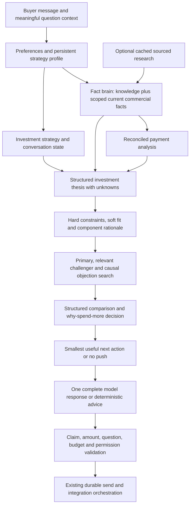

# Off-plan property advisor upgrade

This report describes the review-branch upgrade from current main commit `1279e24b83fbc636a25b186c1deac2374baa15c2`, inspected on 6 October 2026. That commit was also the successful Railway production deployment at inspection. The work extends the existing commercial advisor; it preserves the deterministic fact, budget, permission, action-completion, integration and webhook-deduplication boundaries. No production property/research records or Railway configuration were changed, and this report does not certify a live rollout.

Supporting evidence: [live inspection](live-inspection-notes.md), [optional Airtable contract](OFF-PLAN-DATA-CONTRACT.md), [existing commercial advisor](COMMERCIAL-ADVISOR.md), [handover](HANDOVER.md), [acceptance](ACCEPTANCE.md), and [historical Airtable contract](AIRTABLE_LIVE.md). Earlier documents retain their historical implementation context; this report and the optional contract describe the new review-branch behavior.

## 1. Architecture before

The inspected main already separated FACT BRAIN, BROKER BRAIN and SALES BRAIN. `understand`/`extract` captured volunteered preferences; `BuyerService` and durable conversation memory retained buyer cards, questions and permissions. Airtable Projects/Units supplied source-backed knowledge and freshness-gated commercial facts. `match-resolve`, fit assessment and `advisor-opportunities` enforced constraints, selected a primary/challenger and applied the existing why-spend-more test. Strategy chose a useful next step. Optional structured model composition was validated before sending, with deterministic fallback. The orchestrator serialized events, persisted decisions, deduplicated webhooks and retried integrations.

The investment conversation was centered on the legacy `rental_income`, `growth`, `balanced` objective. Richer Airtable research tables were not consumed. Payment ratios did not establish a dated cash-deployment schedule, and the system lacked a dedicated structured investment thesis and property comparison layer.

## 2. Architecture after

Knowledge and commercial truth have separate paths. A known project can support useful non-commercial discussion when no live unit can be quoted. Research does not activate inventory. Missing evidence produces `UNKNOWN`, null or an empty evidence set. Internal fit ordering remains explainable through components; there is no buyer-facing numerical investment score and no appreciation forecast.

## 3. Files changed

New production modules:

- `src/conversation/investment-strategy.js`, `investment-thesis.js`, `investment-guidance.js`.
- `src/conversation/payment-analysis.js`, `comparison.js`, `comparison-reply.js`, `project-relations.js`.
- `src/conversation/conversation-state.js`, `knowledge-advice.js`.
- `src/facts/intelligence.js`, `commercial-offers.js`, `advisor-claims.js`.

Existing production modules enhanced:

- `prompts/conversation-policy.md`.
- `src/conversation/advisor-opportunities.js`, `advisor-strategy.js`, `advisory-memory.js`, `choices.js`, `decision.js`, `engine.js`, `extract.js`, `fit-assess.js`, `llm.js`, `match-resolve.js`, `memory.js`, `replies.js`, `response-validation.js`, `understand.js`.
- `src/facts/checker.js`, `freshness.js`, `retrieval.js`.
- `src/matching/matcher.js`, `src/schema/fields.js`, `src/services/buyer-service.js`, `property-service.js`, `src/store/airtable-store.js`.

New and revised tests are listed in section 18. `scripts/verify-off-plan-transcripts.js` provides reproducible deterministic transcript capture. Documentation adds this report, `OFF-PLAN-DATA-CONTRACT.md`, `live-inspection-notes.md`, final test evidence and transcripts; existing handover/acceptance/Airtable documents link to the upgrade. The PR's file diff is authoritative for the final file list.

## 4. New and enhanced engines

| Engine | Structured responsibility |
| --- | --- |
| Investment strategy | Return intent, income timing, exit/holding strategy, dimension priorities and weights |
| Investment thesis | Evidence-backed entry, area, project, payment, supply, liquidity, exit, bull/risk cases and unknowns |
| Payment analysis | Approved single-plan reconciliation, booking credit, cash windows, phase totals and separate fees |
| Comparison | Exact sourced differences, buyer-relevant advantages, trade-offs, hard failures and preference |
| Project relations | Supported shared area/developer/product/price-band links and explicitly evidenced geographic links |
| Conversation state | Exploring, learning, searching, comparing, evaluating, objecting, shortlisting, high intent, transaction prep, handoff, stopped |
| Knowledge advice | Useful project positioning without current commercial inventory |
| Optional research adapters | Normalize source, record, date, scope, confidence and rejection reasons |
| Scoped commercial offers | Separate future live-offer gating from legacy unit/project terms |
| Advisor claim registry | Application-owned traceability for research and calculated facts |

## 5. ROI and investment model change

ROI now means umbrella investment return intent: capital appreciation plus rental income, less costs. `2M. Best ROI.` captures the budget and `investmentGoal=total_return`; it does not force rental income versus growth. A later `Capital growth.` records appreciation as the main return driver while retaining total-return intent, and advances the strategy without defining the term.

Exit horizon changes what constitutes a good fit. Handover exit emphasizes entry/release timing, cash deployed, competing handovers and resale evidence. A longer hold emphasizes area maturation, masterplan, product, supply, tenant/end-user appeal and documented rental/cost fallback. Immediate income derives `READY_INCOME` and excludes off-plan from that direct route. Income after handover is a separate strategy. Strategy can remain `UNDECIDED`; buyers are not forced through a field-by-field interview.

Historical developer repricing remains an observation, not a future appreciation claim. The implementation does **not** add IRR or hypothetical sale-return calculations. Live payment timing, costs and comparables are insufficient to expose a defensible scenario framework now. The composition contract forbids the model from calculating or inventing those results; any future scenario feature must explicitly display its assumptions and `ASSUMPTION — NOT FORECAST`.

## 6. Buyer memory changes

Additive defaults cover `investmentGoal`, `investmentStrategy`, `exitHorizon`, `holdingPeriod`, `incomeRequirement`, `growthPriority`, `liquidityPriority`, `riskTolerance`, `cashDeploymentPreference` and `handoverStrategy`. Existing `investmentObjective` remains compatible with old cards. Explicit bedrooms/initial-cash/financing constraints have flags; area-removal corrections can open the search and remove an abandoned preference.

Existing budget, stretch, cash, area/type, timeframe, priorities, concerns, objections, shown/rejected options, active recommendation and upgrade-declined fields remain. Rejection records retain unit/project, reason, fact fingerprint and evidence state. Short `Handover`, `Hold`, `Both` and flexibility replies are interpreted against meaningful question context. Changing from a five-year hold to a handover exit clears the conflicting old holding period. Explicit end use clears investment strategy while preserving budget and consent.

Buyer identity, phone, contact channel, no-call, contact-declined and stopped state remain on the existing durable buyer card. Optional research failure never resets buyer memory. No Airtable buyer-field migration, production data rewrite or new mandatory interview is required.

## 7. Fact brain changes

Legacy Projects/Units source, activation and freshness behavior remains. Separate knowledge packs carry project identity, developer, area, description and documented product facts without inheriting a live quote. Optional intelligence carries exact research scope and provenance; current commercial quotes remain governed by commercial freshness.

`PropertyService.catalog().intelligence` defaults safely to empty arrays for price history, market snapshots, areas, offers and payment schedules, plus limitation codes. Optional table absence, authorization failure or unusable rows do not break core catalog loading. Stable research is cached separately for 15 minutes; core commercial data and future configured offer/payment adapters refresh at 60 seconds. Claim freshness is rechecked at use, and Airtable requests respect the base rate limit. Runtime does not query the Google Sheet on each buyer message.

## 8. Investment thesis engine

`buildInvestmentThesis` returns `strategy`, project/unit identity, `entryCase`, `areaCase`, `projectCase`, `paymentCase`, `supplyCase`, `liquidityCase`, `exitCase`, `bullCase`, `tradeoffs`, `riskCase`, `evidenceStrength`, `unknowns` and `unsupportedClaims`. Every supported item carries source, record, scope and verification date. Evidence strength describes available evidence, not confidence in predicted returns.

Entry can include a current scoped starting price, same-scope observed developer/launch prices, historical difference and exact-size AED/sqft basis. Different products, sizes or asking/developer/transaction bases do not manufacture a price movement. Payment can identify supported handover exposure; ready status can support immediate-income timing suitability without asserting rent. Sourced area catalysts/risks and competing supply enter only when independently documented. A transaction sample is evidence of recorded activity, not a conclusion of strong resale demand.

Launch/release stage, comparable valuation, product quality, future appreciation, resale value, net rent/costs and other absent dimensions remain unknown. No invented forecast appears in the thesis; `forecastAllowed=false` and forecasts remain empty.

## 9. Matching and recommendation changes

Hard constraints are assessed before soft fit or commercial opportunity: permitted budget ceiling, fixed area/type, required bedrooms, supported initial-cash ceiling, and explicit financing requirements. Mortgage eligibility must be supported where required. `READY_INCOME` requires documented ready status/handover. Legacy compromise paths cannot reintroduce candidates that fail these constraints.

Preferred areas and acceptable types are considered across the whole stated set, rather than only the first value. A preferred-area challenger remains a documented compromise; a fixed-area buyer receives no cross-area challenger. Fit assessment exposes `MATCH`, `FIT_WITH_TRADE_OFF`, `STRATEGIC_ALTERNATIVE`, or `POOR_FIT`, with dimension statuses rather than invented certainty.

Recommendation rationale includes price, cash, area, type, space, timing, payment, investment strategy, liquidity and risk components. Strategy weights affect supported dimensions only; absent market evidence never becomes an average score. Equivalent supported options can favor the cheaper home. Differing or unknown product facts do not establish equivalent suitability.

## 10. Comparison engine

`compareProperties` consumes current confirmed scoped facts and produces property identities, exact differences/deltas, advantages for each side, trade-offs, unknown dimensions, hard-constraint failures, a buyer preference with reason codes, and an upgrade assessment. Supported dimensions include starting price, initial cash, bedroom configuration, size range, area/type/status, handover, plan, and reconciled construction/handover cash.

Overlapping size ranges prove no particular home is larger; overlapping handover ranges prove no earlier completion. Payment comparisons require compatible, complete, sourced plan evidence. Lower construction cash can expose a higher handover balloon in the same comparison. `comparisonReply` explains those differences and can state a decisive preference or `I wouldn't pay the extra…` when supported.

## 11. Upsell engine

The existing why-spend-more test is retained and strengthened by structured comparison/payment evidence. An upgrade identifies the reference and upgrade records, exact extra starting-price cost, supported buyer-relevant benefits and trade-offs. Relevant gains can include documented extra space/bedrooms, lower initial or construction cash, or suitable timing; higher price, branding or a developer name is not a benefit.

Permission to stretch does not replace benefit evidence. A hard cap stays hard, stretch is explicit and bounded by existing policy, and over-original-budget recommendations expose the fact. A more expensive equal option yields no upsell; a rejected upgrade stays suppressed. Exact deltas remain starting-price comparisons, not all-in payable amounts.

## 12. Cross-sell engine

At most one relevant challenger accompanies the primary. It must solve a need: supported lower price/cash, different documented payment structure, suitable size/timing, or a strategy-relevant ready route. Original preferred area remains intact; fixed area/type/bedroom and budget constraints remain binding. The relationship graph supplies supported links for comparisons and alternatives, but a relationship alone is not a buyer benefit.

## 13. Objection and rejection engine

| Objection | Required search change |
| --- | --- |
| Initial payment too high | Lower documented initial commitment |
| Too expensive | Lower starting price |
| Too small / large | Supported size or bedroom change relevant to the stated need |
| Handover too late / soon | Non-overlapping documented earlier/later handover |
| Payment plan bad | Different documented structure or supported cash/plan benefit |
| Wrong area/type or developer concern | Requested supported alternative within remaining hard constraints |
| Needs time, trust, existing agent, stop | Reduce pressure, resolve concern or stop |

The active objection retains its rejected-option baseline across later turns rather than drifting to every new recommendation. Rejections preserve what evidence existed. A mere check-date refresh or unrelated price/feature change does not resurrect an option. The relevant objection must resolve through material supported evidence, an explicit buyer request, or changed preferences.

## 14. Next-best action and closing

Conversation state guides the next decision without granting action permission. Advice comes before at most one useful question. ROI/growth can ask exit horizon when unknown; known budget/horizon is not re-asked. Comparison and payment breakdown are ordinary micro-commitments. High-intent proceeding advances to availability/transaction preparation rather than restarting qualification.

The existing contact and handoff engine remains authoritative. Phone number and WhatsApp request are not call consent. No-calls survives subsequent advice and sales steps. `I'm good` stops qualification/capture. EOI/viewing intent can initiate the permitted handoff path; it cannot claim a reservation, submission, booking or send occurred. The model composes one complete response and cannot append generic qualification or authorize operations.

## 15. Commercial offers and payment engine

Current research offers are always excluded from live quotes. A future separately configured production offer must be approved, explicitly bot-enabled, sourced, current, unexpired when validity is supplied, correctly linked to a project/product/unit, with positive price/basis and supported availability. Offer fields form a separate commercial scope; missing offer terms cannot be filled with unrelated old project price, plan or handover. Linked offers can supersede the legacy quote while retaining known physical unit characteristics.

`analyzePaymentSchedule` requires a single approved, current, sourced, enabled and correctly scoped plan. Explicit milestone IDs/kinds/percentages reconcile to 100%; duplicate rows or invalid totals are rejected. A booking credit is deducted only from its explicitly linked later milestone, once. Currency rounding reconciles without creating negative zero-percent payments.

It calculates booking, pre-handover, at-handover and post-handover purchase amounts; 30-day/six-month/twelve-month amounts require supported dates/offsets. Calendar-month windows handle month-end correctly. An otherwise reconciled plan can have known phase totals and unknown dated cash windows. Fees stay separate and remain unknown until their completeness is explicit. Free-text `60/40` never creates installments or dated cash requirements.

## 16. Area, market and relationship integration

Areas can provide identity, sourced summary/maturity/masterplan, explicitly approved dated catalysts, documented risk and competing supply. Current live research lacks that authority, so its notes are not buyer-facing area stories. Geography is never inferred from project names or shared-area membership.

Price History retains developer/launch/asking/transaction distinctions and exact product/unit/size/date scope. Market Snapshot requires usable dated sources and confidence; transaction medians require at least five observations. Asking medians need a separately documented asking sample; trends need a comparable basis. Those missing fields prevent current numeric trend/median columns from becoming unsupported market conclusions.

Project relations support sourced same area/developer/product/masterplan and documented starting-price bands. Comparable products can link documented ready/off-plan alternatives. Earlier/later phases need an explicit shared masterplan and numeric phase sequence; the current live schema does not supply those facts. Explicit `nearby`/`direct_competitor` edges require their own evidence. Phase order, guaranteed demand and complete masterplan progression are not inferred from names. These are limited, evidence-backed graph capabilities, not a geographic or market-prediction model.

## 17. Safety, factual validation and observability

The model receives buyer message/history, profile, state, selected matches/primary/challenger, opportunities, investment theses, comparison facts, objections, allowed claims, required question, allowed/forbidden actions and deterministic strategy. It cannot independently select inventory, perform commercial arithmetic, grant budget/contact/call permission, or complete a transaction.

Research/calculated citations bind an application-issued evidence ID to the exact record/field/value/project/unit scope and exact text span. Model-authored provenance cannot create evidence. Name/price citations cannot cover an invented amenity, catalyst, liquidity claim or urgency. Historical prices cannot be quoted as current offers. Validation rejects unsupported forecasts, prices, availability, plan terms, features, supply/demand, scarcity, permissions, completed actions, repeated known questions and the obsolete universal ROI gateway. Rejection or malformed/failed composition uses deterministic safe copy.

Structured logs record conversation/investment strategy, primary/challenger, opportunity type, objection category, model used/fallback/disabled, validation-rejection categories, source category, commercial-gate rejection and next action. They do not include unnecessary buyer/model text or secrets; transport/parse failures log safe error types/status rather than response bodies.

## 18. Tests added and revised

| Suite | Coverage |
| --- | --- |
| `step30-elite-broker.test.js` | All 30 numbered mandatory broker scenarios, plus malicious model-output categories |
| `step27-investment-profile.test.js` | ROI/growth/horizon/income, short answers, area corrections, explicit constraints, legacy memory, rejection evidence and end-use correction |
| `step27-advisor-matching.test.js` | Strategy fit, hard constraints, financing/cash exclusions, causal objections, rejection suppression and primary/challenger traces |
| `step27-comparison.test.js` | Exact deltas, useful opinions, cheaper fit, constraints, ranges, unknowns and payment-exposure comparisons |
| `off-plan-thesis-payment.test.js` | Schedule reconciliation/booking credit/calendar windows/fees, history scope, weak samples, catalysts, thesis risks and explicit relations |
| `off-plan-intelligence.test.js` | Observed Airtable contracts, absent optional tables, cached adapters, research-offer exclusion, sourced normalization and offer isolation |
| `step29-elite-composition-safety.test.js` | Complete composer context, adversarial price/appreciation/availability/plan/catalyst/demand/scarcity/consent/stretch/EOI claims, citation scope, no-calls and safe logging |

Existing understanding, fit, opportunities, commercial-advisor, advisor-safety and DM transcript suites were updated where the ROI gateway now becomes exit-horizon guidance. Existing freshness, permission, stopped-state, integration and webhook tests remain required. Synthetic fixtures and mocked model/provider calls establish code behavior; they are not claims about live stock or completed customer transactions.

## 19. Complete test results

All required checks passed. The complete assertion run passed **525 tests**, with zero failures/skips. Two final contextual regressions were then added and checked independently (**2/2 passed**) without repeating the full suite: contextual `Hold.` cannot reserve a unit, and an explicit call request remains actionable when no units exist. These focused checks cover the final additions; 527 individual tests have passing captured evidence across the full and focused runs.

| Command | Result | Full output |
| --- | --- | --- |
| `npm test` | PASS; 36 test files | [npm-test.txt](test-results/npm-test.txt) |
| `npm run verify:spec` | PASS | [verify-spec.txt](test-results/verify-spec.txt) |
| `npm run verify:m1` | PASS; 12 checks | [verify-m1.txt](test-results/verify-m1.txt) |
| `npm run verify:m2` | PASS; 7 checks | [verify-m2.txt](test-results/verify-m2.txt) |
| `npm run verify:m3` | PASS | [verify-m3.txt](test-results/verify-m3.txt) |
| `node --test --test-isolation=none --test-reporter=spec test/*.test.js` | PASS; 525 assertions, 5 suites | [full-regression.txt](test-results/full-regression.txt) |
| `node --test --test-isolation=none --test-reporter=spec --test-name-pattern='elite context:' test/step30-elite-broker.test.js` | PASS; 2 final regressions | [final-context-checks.txt](test-results/final-context-checks.txt) |

The managed Node 24 runner reports one success per file for its default isolated runs. The explicit no-isolation run exposes and executes the inner assertions, including all 30 broker scenarios and ten model-adversarial categories. Milestone scripts were made reproducible using temporary local buyer storage and today's verification date for offline synthetic fixtures. Bundled seed dates and production freshness policy were not changed. The obsolete milestone reservation-to-call assertion now checks the existing permission-aware channel choice instead of inventing call consent.

## 20. Live data limitations

Read-only Airtable inspection found zero active Units, zero Price History records and zero Market Snapshot records. Offers (research) has ten records; sampled rows are drafts, disabled and have unknown availability. Its schema lacks commercial checked date/linked structured payment-plan authority. Areas (research) has identities but no source/date/approval contract for its notes/catalysts. No structured payment schedule table exists.

The master Google Sheet has ten populated draft offers in the inspected range, and its review queue explicitly states zero quote-ready offers. Nineteen milestone rows across eight public plans are draft summaries, without actual dates/triggers. The historical project archive is explicitly incomplete and sampled launch years are unresearched. The workbook has no Price History, Market Snapshot or Areas tab; those Airtable structures are separate. Current data cannot establish strongest appreciation, net yield, transaction depth, supply risk, catalyst impact or accurate dated construction cash. Useful strategy/project discussion remains possible, with no fake live match.

## 21. Airtable tables the bot can now consume

| Table | Authorized runtime use |
| --- | --- |
| Developers | Existing activation/identity |
| Projects | Existing knowledge/commercial boundary; explicit Sheet Project ID research mapping |
| Units | Existing source/freshness-gated commercial inventory |
| Price History | Optional scoped sourced observations; no forecasts/live-offer conversion |
| Market Snapshot | Optional sourced sufficiently sampled/comparable evidence; weak fields withheld |
| Areas (research) | Identity plus independently sourced approved facts where a future reliable contract supports them |
| Offers (research) | Diagnostic normalization only, always blocked from live quoting |
| Separately configured live Offers table | Optional scoped current approved commercial quotes; disabled until configured |
| Separately configured Payment Schedules table | Optional reconciled scoped structured schedules; disabled until configured |

See [OFF-PLAN-DATA-CONTRACT.md](OFF-PLAN-DATA-CONTRACT.md) for observed exact schema, required provenance, source gates, configuration defaults and absence behavior. No new table or production field was created.

## 22. Tables and fields still ignored or withheld

`Table 1` is ignored. The master Google Sheet is a research reference, not a runtime query source; its Leads, Content, Build notes, Launch/Launch tests, guide/review UI and developer catalog counts do not become serving facts. No runtime adapter imports its historical project archive as price appreciation.

Research offers' draft prices are withheld as commercial truth. Unsourced area notes/catalysts, weak/unsupported medians, unscoped trends, unresearched launch dates, undocumented proximity/phase links, unverified supply and undated payment summaries are withheld. Unavailable data remains unknown; population alone does not bypass approval or freshness.

## 23. Railway rollout plan

1. Review the branch PR, this report, data contract and final full test output. Verify no property data/schema or infrastructure mutations are in the change.
2. Recheck production deployment, persistent volume and single-replica requirement. The inspected baseline is deployment `9467e37c-933e-4fc1-a4b8-519ef2740cdc`, main SHA `1279e24b83fbc636a25b186c1deac2374baa15c2`, one `sfo` replica and `/data` volume.
3. Obtain the user's explicit release authorization before merging/deploying. Railway already tracks `main` with `checkSuites=false`; merging may trigger its existing deployment integration. Opening/pushing the review branch does not authorize that release. This task performs neither merge nor deploy nor configuration change.
4. After an authorized release, verify terminal Railway `SUCCESS`, deployed SHA/policy hash, health and persistent buyer memory. Run a separate-account Instagram acceptance journey using real approved data, including no-unit advice, ROI/horizon, objections, stop/no-calls, permitted handoff and duplicate-event replay.
5. Inspect non-sensitive validation/gate/fallback categories. Keep research approval/offer activation outside the code PR. Local synthetic inventory must never seed production.

## 24. Rollback plan

Before authorized rollout, record the current deployed SHA and deployment ID again; production may have advanced since inspection. If the new release fails acceptance, use the recorded known-good deployment's Railway rollback capability after user authorization, or revert the upgrade through a reviewed GitHub revert PR when a source-controlled rollback is appropriate. Verify resulting `SUCCESS`, health, policy hash and buyer permission persistence.

Do not delete/reset the `/data` volume, buyer cards, conversation history or webhook state. The upgrade uses additive defaults and requires no Airtable migration, so rollback does not require rewriting property or buyer records. Optional research/offer settings can remain absent as in the inspected baseline. No rollback was performed here.

## 25. Before/after transcripts

Measured deterministic transcripts use the same fictional fixture and message sequence against baseline commit `1279e24b83fbc636a25b186c1deac2374baa15c2` and the review branch. No messages were sent to real buyers. Fictional prices are demonstration values, never live commercial quotes. Full outputs: [before](test-results/transcripts-before.txt), [after](test-results/transcripts-after.txt). Reproduce the current branch with `node scripts/verify-off-plan-transcripts.js`.

With no active units:

| Buyer | Before | After |
| --- | --- | --- |
| I have AED 2M. I want the best ROI. | Regular rental income, long-term growth, or a mix? | ROI is appreciation plus rental income less costs; compares entry/stage/cash/supply/resale and asks exit horizon. |
| Capital growth. | No confirmed option; asks for another area. | Records appreciation driver, advances strategy and asks the useful unknown exit horizon. |
| Handover. | Which project would you like me to check? | Stores `HANDOVER_EXIT`; discusses entry timing, cash and resale competition without fabricating a quote. |
| Tell me about Fixture A | Repeats no-match/area path. | Explains its documented Yas location/developer/community and the limits of its commercial evidence. |
| What are the risks? | Repeats no-match/area path. | Discusses payment exposure, supply, resale liquidity and costs as diligence, with missing evidence explicitly unknown. |
| Will this appreciate 20%? | Repeats no-match/area path. | Refuses a promise and separates historical observations from hypothetical assumptions. |

With current **fictional** records, handover exit recommends Fixture A at AED 1,800,000. Comparison against Fixture B at AED 2,000,000 exposes the AED 200,000 entry-price difference and AED 20,000 initial-cash difference. With equivalent supported product facts and no added buyer benefit, the advisor says it would not pay the extra and prefers A. `Which would you buy?` preserves the known exit horizon rather than reclassifying the buyer as an owner-occupier. `No calls` persists; `I want to proceed` offers an availability check without claiming anything was reserved; `I'm good` stops the sales path.
